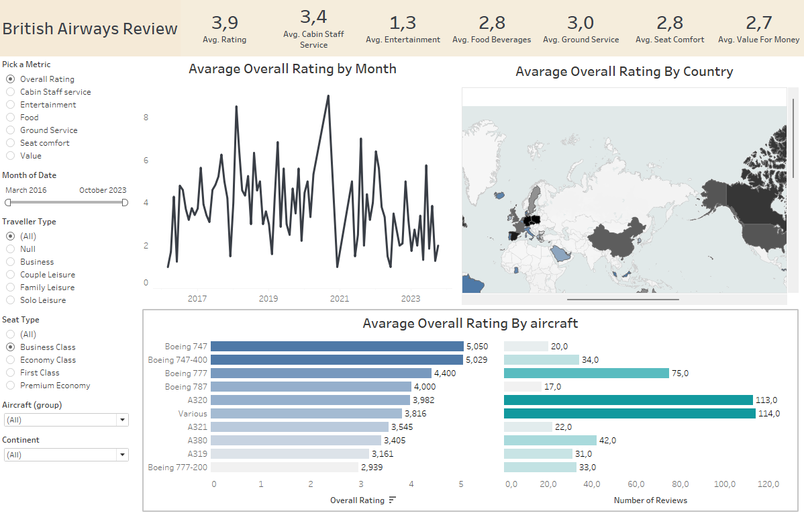

# Tableau-Project-British-Airways-Review-Dashboard

This project is an interactive customer review analytics dashboard built with Tableau, designed to provide insights into customer satisfaction across various aspects of British Airways services. The dashboard enables users to explore airline review data dynamically by filtering across multiple dimensions such as rating metrics, traveler type, seat type, aircraft model, and geographic region.

# Features:

Overview Metrics: High-level KPIs showing average ratings for overall experience, cabin staff, entertainment, food, ground service, seat comfort, and value for money.

Rating Trend Analysis: Line chart displaying how the average overall rating has changed over time from 2016 to 2023.

Country-wise Rating Distribution: Geographic map visualizing average overall ratings by country, helping to identify regional patterns in satisfaction.

Aircraft Review Comparison: Horizontal bar chart showing average ratings across different aircraft types such as Boeing 747, A320, A380, and more.

Review Filter Options: Interactive filters to explore data by metric, travel date, traveler type (e.g., Business, Family Leisure), seat type (e.g., Economy, Business), aircraft group, and continent.

# Key Visualizations:

KPI Cards: Average ratings across key service categories like food, seat comfort, staff service, and more.

Line Chart: Monthly trend of overall customer ratings over the selected time range.

Map Visualization: Country-wise average overall rating.

Bar Chart: Average overall rating by aircraft type and number of reviews.

Filter Panel: Dynamic filters for deep exploration by user preferences and travel attributes.

# Screenshot:

